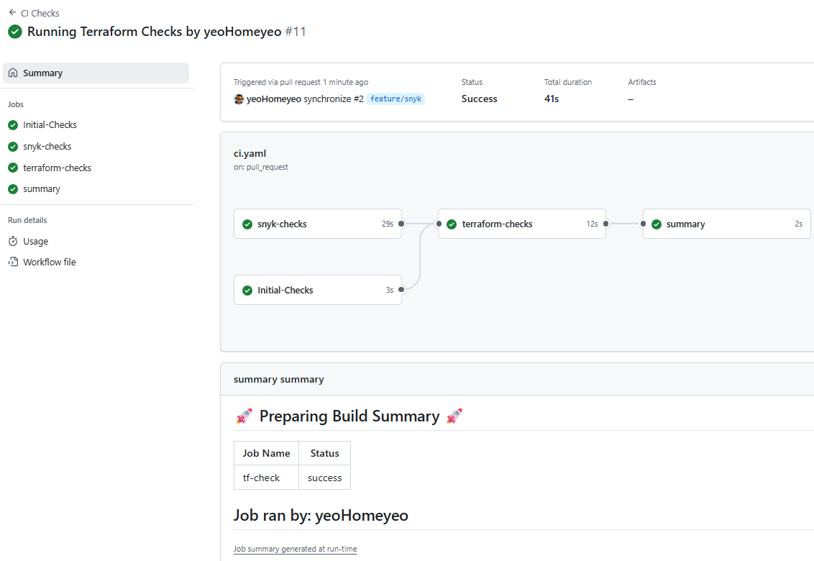
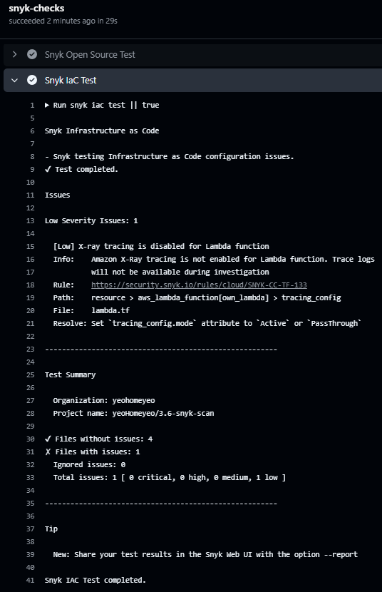
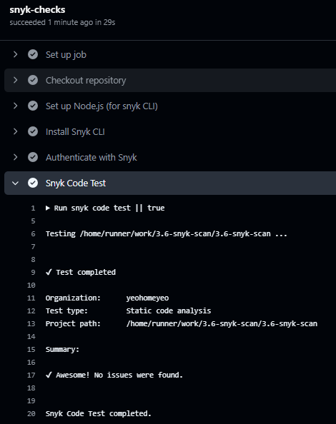
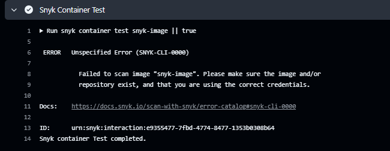
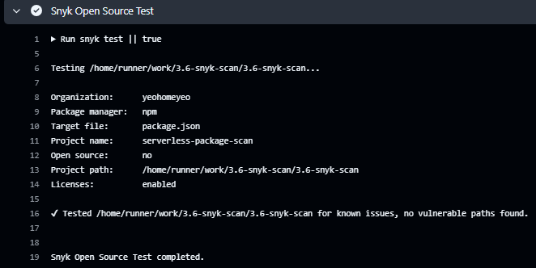

### VPC serve no purpose, so removed
## Successful Run

<br/>

## IaC Test

<br/>
## Code Test

<br/>
## Container Test

<br/>
## Open Source Test

<br/>
## Code Added to CI.yaml

```
  snyk-checks:
    runs-on: ubuntu-latest
    outputs:
      status: ${{ job.status }}
    steps:
      - name: Checkout repository
        uses: actions/checkout@v3

      - name: Set up Node.js (for snyk CLI)
        uses: actions/setup-node@v3
        with:
          node-version: "18"

      - name: Install Snyk CLI
        run: npm install -g snyk

      - name: Authenticate with Snyk
        env:
          SNYK_TOKEN: ${{ secrets.SNYK_TOKEN }}
        run: snyk auth $SNYK_TOKEN
        
      - name: Snyk Code Test
        run: |
          snyk code test || true
          echo "Snyk Code Test completed."

      - name: Snyk Open Source Test
        run: |
          snyk test || true
          echo "Snyk Open Source Test completed."

      - name: Snyk IaC Test
        run: |
          snyk iac test || true
          echo "Snyk IAC Test completed."

      - name: Snyk Container Test
        run: |
          snyk container test snyk-image || true
          echo "Snyk container Test completed."

      - name: Set status output
        id: set-status
        run: echo "status=success" >> $GITHUB_OUTPUT
```

<br/>
<br/>
<br/>
<br/>
<br/>
<br/>
<br/>
<br/>

# Scanning serverless code with Snyk and NPM Audit

## What is package vulnerability scan?

Package vulnerability scanning refers to the process of analyzing software packages, dependencies, libraries, or modules to identify security vulnerabilities within them. 

Software often relies on various third-party packages or libraries to provide functionality, and vulnerabilities within these dependencies can pose significant security risks to the overall application.

### Process

<b>Package Vulnerability Scanning Process:</b> 

- <b>Identification:</b>  Tools or services scan through the dependencies used in a project, checking against databases of known vulnerabilities.
- <b>Analysis:</b>  The scanning process assesses the versions of these dependencies against a database of known vulnerabilities, determining if any matches are found.
- <b>Report Generation:</b>  The scanning tools generate reports highlighting identified vulnerabilities, their severity levels, and recommended actions to mitigate the risks.
- <b>Mitigation:</b>  Once vulnerabilities are identified, developers can take action to address these issues. Solutions might include updating to patched versions, finding alternative packages, implementing workarounds, or applying security patches.

### Popular solutions

<b>Snyk:</b> Provides scanning and monitoring services for vulnerabilities in dependencies.

<b>OWASP Dependency-Check:</b> Open-source tool for scanning dependencies for known vulnerabilities.

<b>GitHub Dependabot:</b> Built-in tool in GitHub that automatically checks for and creates pull requests to update dependencies.

## What is Snyk?


Snyk is a platform that allows you to scan, prioritize, and fix security vulnerabilities in your code, open-source dependencies, container images, and infrastructure as code configurations.

## Popular Snyk Commands
### Scanning IAC (e.g. Terraform)
```snyk iac test```

### Scanning Code (e.g. JavaScript, Python)
```snyk code test```

### Scanning Open Source Packages
```snyk test```

More detailed information can be found here: https://docs.snyk.io/integrate-with-snyk/snyk-ci-cd-integrations/github-actions-integration

## What does NPM Audit do?

The audit command submits a description of the dependencies configured in your project to your default registry and asks for a report of known vulnerabilities. 

If any vulnerabilities are found, then the impact and appropriate remediation will be calculated. If the fix argument is provided, then remediations will be applied to the package tree.

The command will exit with a 0 exit code if no vulnerabilities were found.

<i>Note that some vulnerabilities cannot be fixed automatically and will require manual intervention or review. </i>

Also note that since npm audit fix runs a full-fledged npm install under the hood, all configs that apply to the installer will also apply to npm install -- so things like npm audit fix --package-lock-only will work as expected.

# Getting Started
## Register for Snyk account
1. Sign up for a Snyk account - https://snyk.io/
2. Once logged in, you can see an overview of linked projects e.g. Github repositories that you import in the Dashboard.

3. Get your AP token by going to the bottom left (your name) > account settings > click to show key under Auth Token > copy token > create a Github Actions Secret in your Github repository called "SNYK_TOKEN"

## Write your lambda function
1. Refer to files/index.js for sample lambda code to be deployed.
2. There is also a files/lambda_function.py for a python version that can be deployed. Changes will need to be made in variable.tf

## Write your terraform code
1. Create all the necessary code to build your infrastructure e.g. Lambda, IAM, VPC, Subnets etc.
2. Include your AWS SECRET KEY and AWS ACCESS KEY in Github Actions Secret.

## Write your Github Actions Workflow file
1. Take a look at the sample .github/workflows/package-scan.yml file on a simple workflow to test IAC, Code and Open Source plugins + npm audit.

## BIG SUCCESS :D

